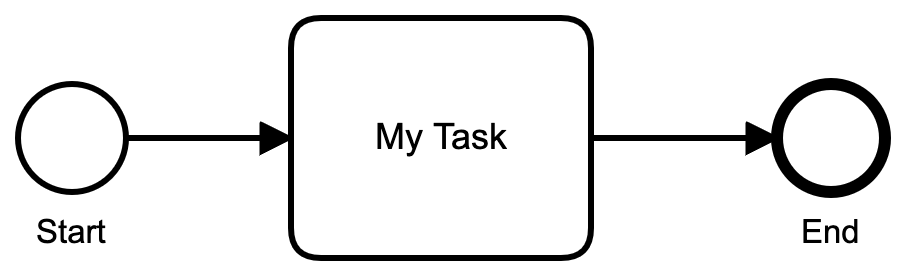

# Processable

Processable is a BPMN/DMN workflow gem for Rails apps.

## Usage

Processable `executes` BPMN documents like this one. 



```xml
<?xml version="1.0" encoding="UTF-8"?>
<bpmn:definitions>
  <bpmn:process id="Example" isExecutable="true">
    <bpmn:startEvent id="Start" name="Start">
      <bpmn:outgoing>Flow_01qy3jb</bpmn:outgoing>
    </bpmn:startEvent>
    <bpmn:task id="MyTask" name="My Task">
      <bpmn:incoming>Flow_01qy3jb</bpmn:incoming>
      <bpmn:outgoing>Flow_084gvp7</bpmn:outgoing>
    </bpmn:task>
    <bpmn:sequenceFlow id="Flow_01qy3jb" sourceRef="Start" targetRef="MyTask" />
    <bpmn:endEvent id="End" name="End">
      <bpmn:incoming>Flow_084gvp7</bpmn:incoming>
    </bpmn:endEvent>
    <bpmn:sequenceFlow id="Flow_084gvp7" sourceRef="MyTask" targetRef="End" />
  </bpmn:process>
</definitions>
```

A `Bpmn::Process` definition can be executed by initializing the `Processable::Runtime` with the document's source. Then a `Processable::ProcessInstance` can be created by calling `start_process`.

```ruby
process_instance = Processable::Runtime.new(sources: File.read('simple.bpmn')).start_process('SimpleProcess')
```

The current status of a `Processable::ProcessInstance` can be printed to the console.

```ruby
process_instance.print
```

```bash
Example started * Flow_1qhq8g6

0 StartEvent Start: ended * out: Flow_01qy3jb
1 Task MyTask: waiting * in: Flow_1qhq8g6
```

The Task `MyTask` is `waiting` to be `invoked` after the work has been completed. 

```ruby
process_instance.step_by_id('MyTask').invoke
```

After `invoking` the task the process continues until it reaches the EndEvent.

```bash
Example ended * 

0 StartEvent Start: ended * out: Flow_01qy3jb
1 Task MyTask: ended * in: Flow_01qy3jb * out: Flow_084gvp7
2 EndEvent End: ended * in: Flow_084gvp7
```

## Documentation

* [Supported Elements](/docs/elements.md)
* [Execution](/docs/execution.md)

## Installation
Add this line to your application's Gemfile:

```ruby
gem 'processable'
```

And then execute:
```bash
$ bundle
```

Or install it yourself as:
```bash
$ gem install processable
```

## License
The gem is available as open source under the terms of the [MIT License](https://opensource.org/licenses/MIT).

Developed by [Connected Bits](http://www.connectedbits.com)