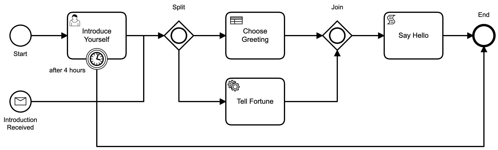

# Processable

Processable is a BPMN/DMN workflow gem for Rails apps.

## Usage

Processable `executes` BPMN documents like this one. 


[Source](test/fixtures/files/hello_world.bpmn)

A `Bpmn::Process` definition can be executed by initializing the `Processable::Runtime` with the document's source. Then a `Processable::ProcessInstance` can be created by calling `start_process`.

```ruby
process_instance = Processable::Runtime.new(sources: [File.read('hello_world.bpmn'), File.read('choose_greeting.dmn')], services: services).start_process('HelloWorld')
```

The current status of a `Processable::ProcessInstance` can be printed to the console.

```ruby
process_instance.print
```

```bash
HelloWorld started * Flow_016qg9x

{
  "greet": true,
  "cookie": false
}

0 StartEvent Start: ended * out: Flow_016qg9x
1 UserTask IntroduceYourself: waiting * in: Flow_016qg9x
```

The Task `IntroduceYourself` is `waiting` to be `invoked` after the work has been completed. 

```ruby
process_instance.step_by_id('IntroduceYourself').invoke({ name: "Eric", language: "es", formal: true })
```

After `invoking` the task the process continues executing until it reaches an EndEvent.

```bash
HelloWorld ended *

{
  "name": "Eric",
  "greet": true,
  "cookie": true,
  "formal": true,
  "message": "👋 Hola Eric 🥠 Avoid taking unnecessary gambles. Lucky numbers: 12, 15, 23, 28, 37",
  "greeting": "Hola",
  "language": "es",
  "tell_fortune": "Avoid taking unnecessary gambles. Lucky numbers: 12, 15, 23, 28, 37"
}

```

## Documentation

* [Supported Elements](/docs/elements.md)
* [Execution](/docs/execution.md)

## Installation
Add this line to your application's Gemfile:

```ruby
gem 'processable'
```

And then execute:
```bash
$ bundle
```

Or install it yourself as:
```bash
$ gem install processable
```

## License
The gem is available as open source under the terms of the [MIT License](https://opensource.org/licenses/MIT).

Developed by [Connected Bits](http://www.connectedbits.com)