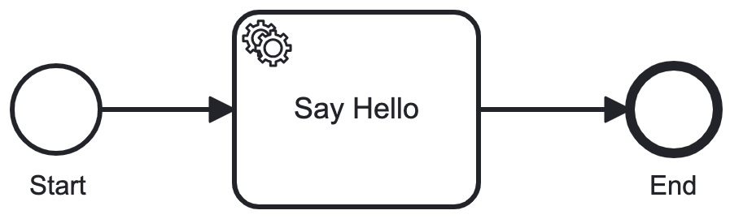

# Processable

Processable is a workflow gem for Rails applications based on the [bpmn](https://www.bpmn.org) standard. It executes business processes and rules defined in a [modeler](https://camunda.com/download/modeler/).

## Usage

Processable executes business processes like [this one](/test/fixtures/files/hello_world.bpmn). 



Prior to execution, a Context must be initialized with sources, services and other configuration.

```ruby
services = {
  tell_fortune: proc { |step, variables|
    if variables[:simulate_error]
      step.error("Error_FortuneNotFound", "Fortune not found? Abort, Retry, Ignore.")
    else
      step.complete([
        "The fortune you seek is in another cookie.",
        "A cynic is only a frustrated optimist.",
        "A foolish man listens to his heart. A wise man listens to cookies.",
        "Avoid taking unnecessary gambles. Lucky numbers: 12, 15, 23, 28, 37",
        "Ask your mom instead of a cookie.",
        "Hard work pays off in the future. Laziness pays off now.",
        "Don’t eat the paper.",
      ].sample)
    end
  }
}
context = Processable::Context.new(sources: [File.read('hello_world.bpmn'), File.read('choose_greeting.dmn')], services: services)
```

Then a new instance of the process can be started.

```ruby
execution = Processable::Execution.start(context: context, process_id: 'HelloWorld', start_event_id: 'Start', variables: { greet: true, cookie: false })
```

An execution tree is returned with the process as the root step. It is often useful to print the current state of the Execution.

```ruby
execution.print
```
```
HelloWorld running * Flow_016qg9x

{
  "greet": true,
  "cookie": true
}

0 StartEvent Start: completed * out: Flow_016qg9x
1 UserTask IntroduceYourself: waiting * in: Flow_016qg9x
2 BoundaryEvent Timeout: waiting
```

Processable executes each step in the process until the flow reaches the end or `waits` at a Task. Here the `IntroduceYourself` UserTask is `waiting` for completion.

At this point you may want to save the current state of execution in a Rails model.

```ruby
json = execution.serialize
```

Later, when the task has been completed, execution can be deserialized.

```ruby
execution = Procesable::Execution.deserialize(json, context: context)
```

Execution is continued by `signaling` the `waiting` step.

```ruby
execution.step_by_element_id("IntroduceYourself").signal({ name: "Eric", language: "es", formal: true })
```

When execution arrives at automated (service, script, and business rule) tasks it will `wait`. You can run the automated tasks in a rails job and signal the execution when the task is complete or have Processable run the automated tasks.

```ruby
execution.run_automated_tasks
```

Once the tasks are completed the process continues executing until it reaches an EndEvent.

```
HelloWorld completed * 

{
  "greet": true,
  "cookie": true,
  "name": "Eric",
  "language": "it",
  "formal": false,
  "tell_fortune": "This cookie contains 117 calories.",
  "greeting": "Ciao",
  "message": "👋 Ciao Eric 🥠 This cookie contains 117 calories."
}

0 StartEvent Start: completed * out: Flow_016qg9x
1 UserTask IntroduceYourself: completed { "name": "Eric", "language": "it", "formal": false } * in: Flow_016qg9x * out: Flow_0f1v8du
2 BoundaryEvent Timeout: terminated
3 InclusiveGateway Split: completed * in: Flow_0f1v8du * out: Flow_09yhdyi, Flow_00mppvp
4 ServiceTask TellFortune: completed { "tell_fortune": "This cookie contains 117 calories." } * in: Flow_09yhdyi * out: Flow_1t20i0c
5 BoundaryEvent Event_0c6rvx0: terminated
6 BusinessRuleTask ChooseGreeting: completed { "greeting": "Ciao" } * in: Flow_00mppvp * out: Flow_1ezhtuc
7 InclusiveGateway Join: completed * in: Flow_1t20i0c, Flow_1ezhtuc * out: Flow_1xiabfq
8 ScriptTask SayHello: completed { "message": "👋 Ciao Eric 🥠 This cookie contains 117 calories." } * in: Flow_1xiabfq * out: Flow_15lbcry
9 EndEvent End: completed * in: Flow_15lbcry
```
## Documentation

* [Processes](/docs/processes.md)
* [Tasks](/docs/tasks.md)
* [Events](/docs/events.md)
* [Event Definitions](/docs/event_definitions.md)
* [Gateways](/docs/gateways.md)
* [Expressions](/docs/expressions.md)
* [Execution](/docs/execution.md)

## Installation
Add this line to your application's Gemfile:

```ruby
gem 'processable'
```

And then execute:
```bash
$ bundle
```

Or install it yourself as:
```bash
$ gem install processable
```
## License
The gem is available as open source under the terms of the [MIT License](https://opensource.org/licenses/MIT).

Developed by [Connected Bits](http://www.connectedbits.com)

## TODO

- [ ] Need to async execution of automatic tasks